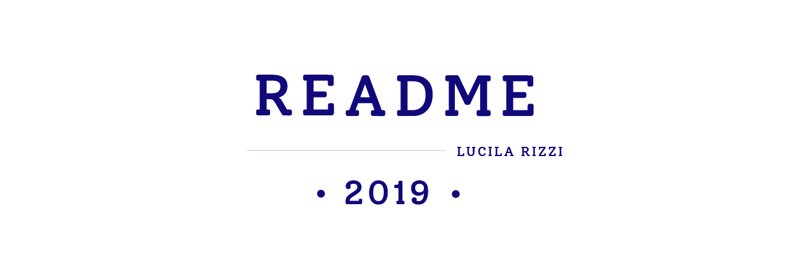
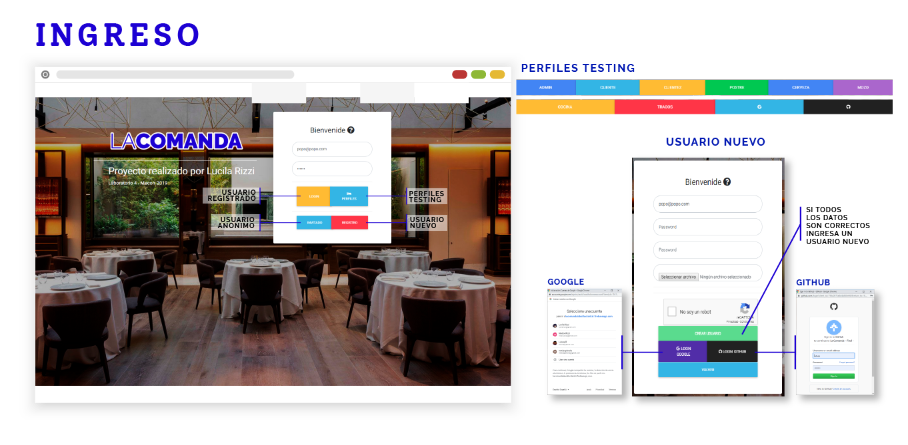
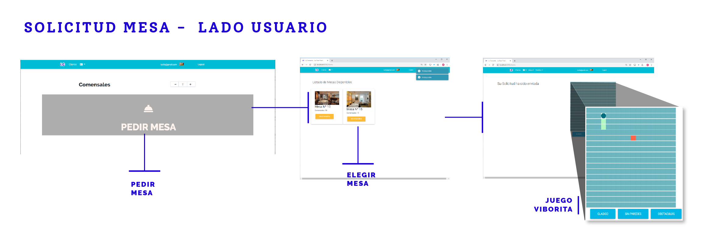
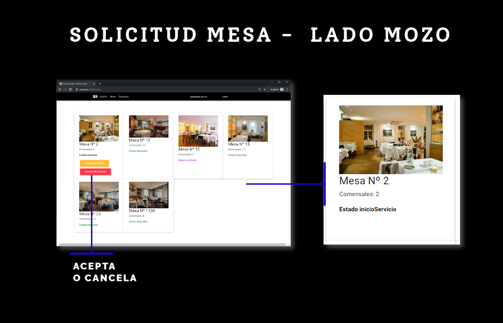
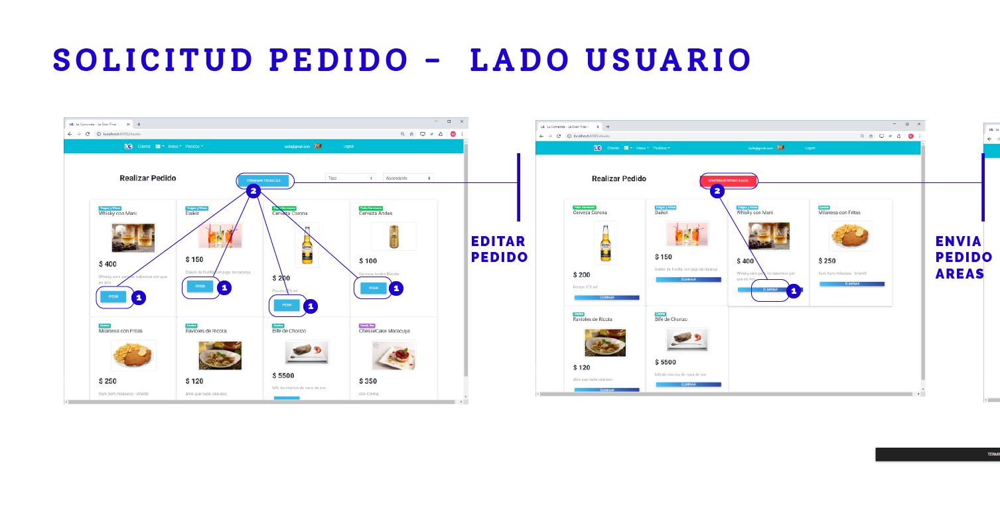
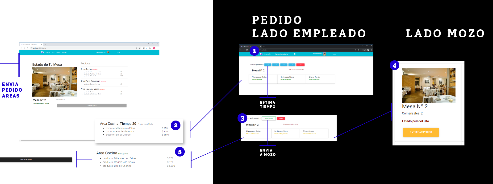
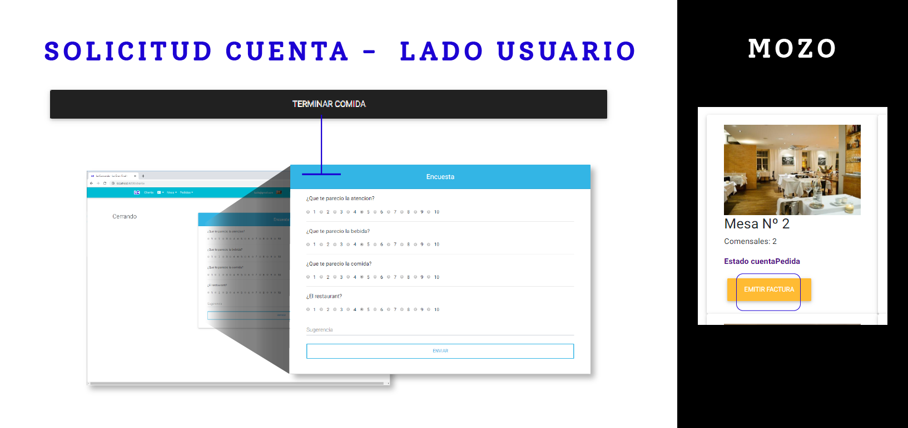
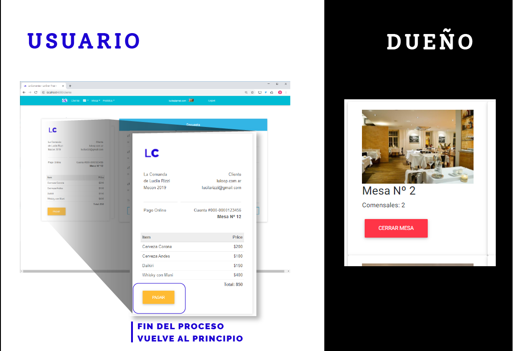
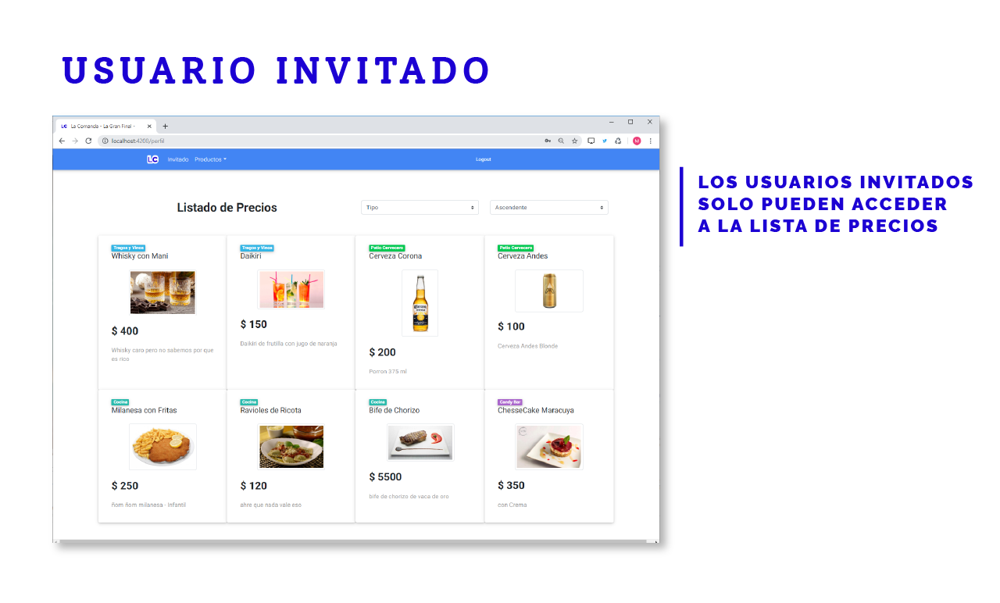
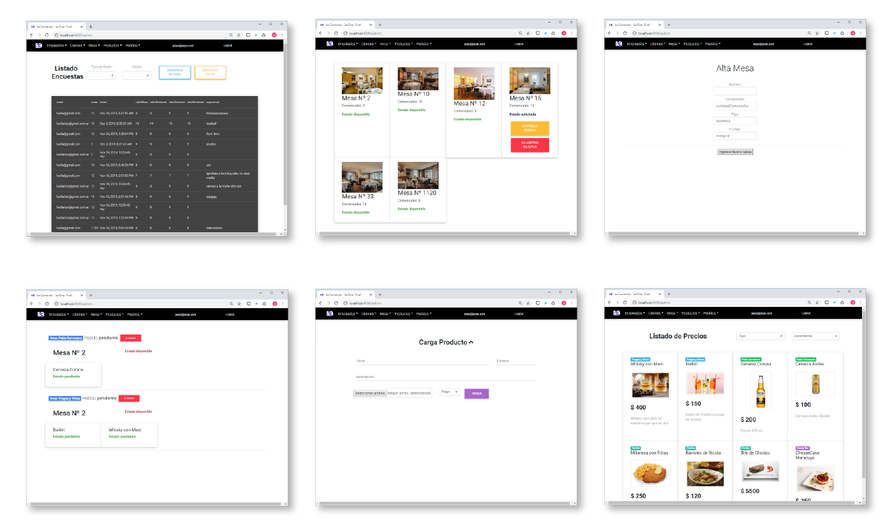

[https://lacomandalabo4lucilarizzi.firebaseapp.com/](https://lacomandalabo4lucilarizzi.firebaseapp.com/)



# Tp de Lucila Rizzi para la Materia Laboratorio 4 de la Tencicatura Superior en Programacion de la UTN FRA
```shell
https://luloop.com.ar
```


## Empezando

### Instalar npm
*Es Importante tener la ultima version de Node*

- [Install Node and NPM on Windows](https://www.youtube.com/watch?v=8ODS6RM6x7g)
- [Install Node and NPM on Linux](https://www.youtube.com/watch?v=yUdHk-Dk_BY)
- [Install Node and NPM on Mac](https://www.youtube.com/watch?v=Imj8PgG3bZU) 

# Installing the Angular CLI

With the following command the angular-cli will be installed globally in your machine:

    npm install -g @angular/cli 

### Clonando el repo

```shell
https://github.com/luloop/TP_LAB4_MECON
cd tp2-laComanda
```

## Instalar el `npm` packages descripto en el  `package.json` y ver que ande:

```shell
npm install
ng serve -o
```

## Dependencies

```shell
@angular/animations : ^8.2.14
@angular/cdk : ~8.2.3
@angular/common : ~8.2.11
@angular/compiler : ~8.2.11
@angular/core : ~8.2.11
@angular/fire : ^5.2.1
@angular/forms : ~8.2.11
@angular/material : ^8.2.3
@angular/platform-browser : ~8.2.11
@angular/platform-browser-dynamic : ~8.2.11
@angular/router : ~8.2.11
@compodoc/compodoc : ^1.1.11
angular-bootstrap-md : ^8.4.0
firebase : ^7.2.1
hammerjs : ^2.0.8
mdbootstrap : ^4.8.11
ngx-spinner : ^8.0.3
ngx-toastr : ^11.2.1
npm : ^6.12.0
rxjs : ~6.4.0
toastr : ^2.1.4
tslib : ^1.10.0
zone.js : ~0.9.1
```


###  Diseño


# Ingreso a la Web
* Todo la pagina se entra por /login, en la misma se encontrar un pack de botones para testing y la posibilidad de registrar un usuario nuevo, tanto con google o con github

## Login y Registro



## Pedido de mesa

---


## Pedido Comida

---


## Pedido Cuenta

---



## Usuario Invitado



## Perfil ADMIN - SOCIO
* en el perfil de admin o socio podemos encontrar el mayor acceso a los datos de todo los q va ocurriendo en el local
Al inicio se ingresa direcmente al area de los estados de mesas ya que es la mas consultada drante todo el proceso comercial





